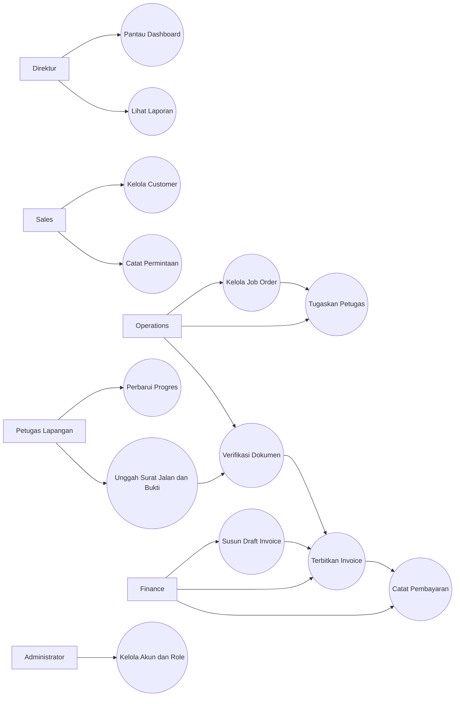
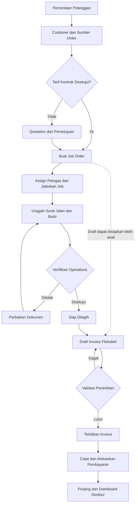
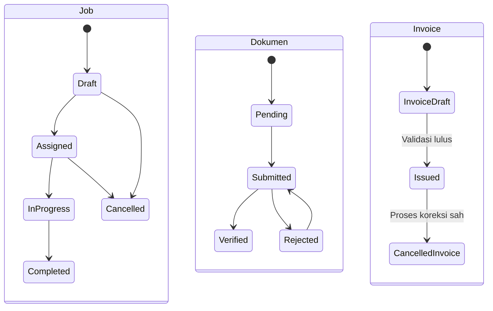
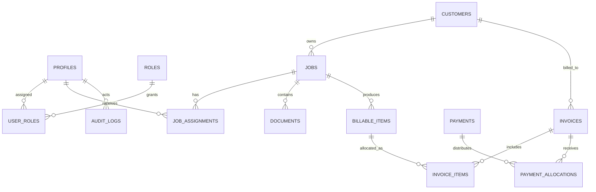
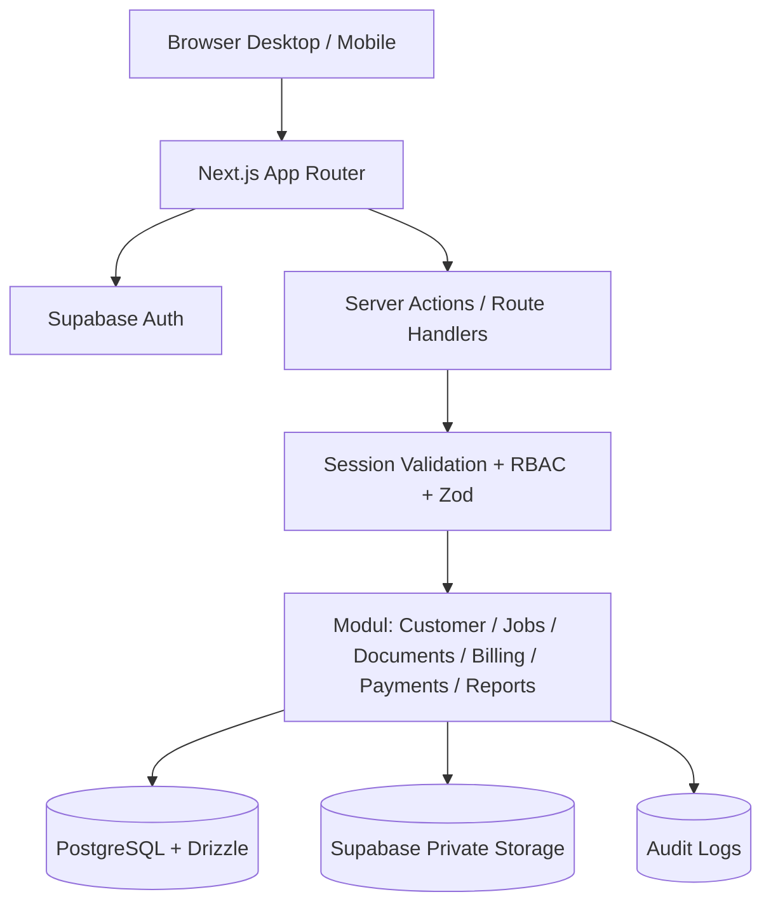

# SGI One — Product Requirements Document (PRD)

> Versi 1.0 · 8 Oktober 2026 · **DRAFT untuk validasi Direktur dan tim SGI**

> Dokumen Markdown ini dikonversi dari PRD DOCX. Diagram gambar dituliskan ulang sebagai diagram Mermaid yang dapat dirender di GitHub dan editor Markdown yang mendukung Mermaid.

Integrated Operations & Business Management System

Sandika Global Indonesia (SGI)  |  Versi 1.0  |  8 Oktober 2026

Status: DRAFT untuk validasi Direktur dan tim SGI  •  Target: prototype interaktif 7 hari

Dokumen kebutuhan produk, use case, proses bisnis, arsitektur, model data, keamanan, acceptance criteria, serta roadmap implementasi.

## Kendali dokumen

| Atribut | Keterangan |
| --- | --- |
| Pemilik produk | Calon tim pengembangan SGI One (penanggung jawab perlu ditetapkan) |
| Sponsor / approver | Direktur SGI (belum dikonfirmasi) |
| Target platform | Web responsif untuk desktop dan mobile |
| Tipe produk | Single-tenant, internal SGI |
| Basis informasi | Wawancara awal karyawan SGI dan diskusi konseptual; belum disahkan sebagai SOP resmi |

## 0. Executive summary

SGI One diusulkan untuk menghubungkan pekerjaan logistik dari penerimaan permintaan, pengelolaan job, pelaksanaan lapangan, verifikasi bukti kerja, hingga penagihan dan penerimaan pembayaran. Masalah pemicu adalah ketergantungan pada surat jalan fisik yang dapat terlambat atau hilang, sehingga Finance tidak dapat menagih tepat waktu. Prototype akan memperlihatkan satu alur nyata end-to-end dengan data simulasi, bukan mengklaim bahwa seluruh ERP telah selesai.

Keputusan produk: single-tenant SGI; modular monolith; flexible invoice draft (boleh dibuat lebih awal) dengan kontrol penerbitan; invoice dapat menggabungkan beberapa job dan mendukung termin melalui komponen tagihan. Semua aturan operasional dan legalitas dokumen digital perlu divalidasi bersama SGI.

## 1. Latar belakang, masalah, dan tujuan

## 1.1 Temuan awal

- Dokumen lapangan masih bergantung pada surat jalan fisik dan tanda tangan; aliran kertas ke kantor menghambat Finance.
- SGI menangani kombinasi layanan logistik/freight forwarding; alur tiap jenis layanan berpotensi berbeda.
- Permintaan pelanggan bisa berasal dari Sales, komunikasi langsung, atau pelanggan kontrak.
- Finance/Accounting menangani pembuatan invoice dan pencatatan pembayaran pelanggan.
- Dibutuhkan kontrol akses bertingkat, keamanan dokumen, dan opsi absensi/HR di tahap lanjut.

## 1.2 Problem statement

Tidak tersedia satu jejak digital yang konsisten dari job yang dikerjakan hingga bukti penyelesaian dan kelayakan penagihan. Akibatnya status pekerjaan dan dokumen sulit dipantau lintas peran, serta proses penagihan rentan tertunda.

## 1.3 Sasaran dan metrik keberhasilan

| Sasaran | Metrik usulan | Cara ukur |
| --- | --- | --- |
| Transparansi pekerjaan | 100% job demo memiliki PIC, status, dan jejak perubahan | Uji skenario demo |
| Ketersediaan bukti | 100% job demo dapat menyimpan dan mengambil dokumen privat | Uji unggah/akses |
| Kesiapan penagihan | Daftar job siap ditagih diturunkan dari verifikasi dan aturan tagihan | Uji workflow |
| Integritas tagihan | 0 double billing pada skenario uji termasuk request paralel | Integration test |
| Visibilitas direktur | Dashboard menampilkan angka konsisten dengan transaksi | Rekonsiliasi sampel |

Catatan: target di atas adalah acceptance criteria prototype, bukan KPI aktual SGI; baseline bisnis harus diukur sebelum rollout.

## 2. Ruang lingkup dan batasan

| Prioritas | Termasuk | Tidak termasuk / batas |
| --- | --- | --- |
| P0 — demo wajib | Login & RBAC; customer; job; assignment; dokumen privat & verifikasi; billable items; invoice draft gabungan; payment parsial; dashboard; audit | Belum menjamin kesiapan production |
| P1 — bila waktu cukup | Quotation ringan; invoice PDF; surat jalan formulir; absensi sederhana; role switch khusus akun demo | Tidak boleh mengorbankan P0 |
| P2 — setelah validasi | Akuntansi penuh, integrasi bank, GPS, WMS, HRIS/payroll, customs API, multi-tenant | Perlu discovery dan scope terpisah |

## 3. Stakeholder, aktor, dan hak akses

| Aktor | Tanggung jawab | Akses utama |
| --- | --- | --- |
| Direktur | Memantau KPI dan mengambil keputusan | Dashboard, laporan, baca lintas fungsi sesuai kebijakan |
| Admin/Operations | Menerima job, menugaskan, memeriksa dokumen | Customers, jobs, assignments, document verification |
| Field staff | Melaksanakan tugas, mengisi bukti | Hanya job yang ditugaskan dan dokumen terkait |
| Finance/Accounting | Membuat tagihan dan mencatat pembayaran | Billable, invoice, payment, AR |
| Sales | Mengelola relasi dan permintaan pelanggan | Customer/request/quotation terbatas |
| System admin | Mengelola akun dan role | User/role, pengaturan, audit terbatas |

Satu orang dapat memegang lebih dari satu role. Otorisasi harus menggunakan permission yang dihitung server-side; menu tersembunyi bukan mekanisme keamanan.

## 4. Alur bisnis end-to-end

1. Permintaan dicatat dan ditautkan ke customer; quotation dapat opsional untuk kontrak yang memiliki tarif disetujui.
1. Operations membuat job, menetapkan jenis layanan, PIC, tenggat, dan penugasan.
1. Field memperbarui progres dan menyerahkan bukti / surat jalan secara digital.
1. Operations memeriksa kelengkapan dan keabsahan bukti sesuai checklist layanan.
1. Komponen tagihan (billable items) disiapkan berdasarkan tarif dan persetujuan.
1. Finance dapat menyiapkan draft invoice kapan pun, tetapi penerbitan harus lulus aturan bisnis.
1. Invoice diterbitkan, pembayaran dialokasikan, dan saldo piutang dihitung dari transaksi.
1. Direktur memantau pekerjaan aktif, dokumen tertunda, invoice, dan outstanding AR.

## 5. Functional requirements terperinci

#### FR-01 — Autentikasi & sesi

Aktor: Seluruh pengguna | Prioritas: P0

Alur: Login dengan akun internal; server memvalidasi sesi di setiap request terproteksi.

Kriteria penerimaan: Pengguna tidak login ditolak; logout mencabut akses sesi; tidak ada role dari input browser.

#### FR-02 — RBAC & scope data

Aktor: Admin, seluruh pengguna | Prioritas: P0

Alur: Permission per aksi; field hanya melihat job yang ditugaskan; Finance mengakses billing.

Kriteria penerimaan: Akses URL/API tanpa izin menghasilkan penolakan; akses file privat konsisten dengan izin.

#### FR-03 — Customer master

Aktor: Admin, Sales | Prioritas: P0

Alur: Buat, cari, ubah customer dan kontak; nonaktifkan daripada menghapus data yang sudah ditransaksikan.

Kriteria penerimaan: Customer memiliki ID stabil; validasi field; relasi job tetap utuh.

#### FR-04 — Job order

Aktor: Operations | Prioritas: P0

Alur: Buat job dari customer, layanan, sumber order, deskripsi, PIC, estimasi waktu, status.

Kriteria penerimaan: Nomor job unik; perubahan status tervalidasi; audit tercatat.

#### FR-05 — Penugasan & pekerjaan lapangan

Aktor: Operations, Field | Prioritas: P0

Alur: Tetapkan satu atau lebih petugas; petugas memperbarui progres dan catatan pekerjaan.

Kriteria penerimaan: Field tidak dapat mengubah job lain; Operations dapat melihat siapa yang mengerjakan.

#### FR-06 — Dokumen & surat jalan

Aktor: Field, Operations | Prioritas: P0

Alur: Upload bukti dan formulir surat jalan; simpan metadata, versi, uploader, timestamp.

Kriteria penerimaan: File privat, tipe/ukuran dibatasi; dapat diunduh hanya oleh pihak berizin.

#### FR-07 — Verifikasi dokumen

Aktor: Operations | Prioritas: P0

Alur: Tandai submitted, verified, atau rejected disertai alasan; checklist sesuai layanan.

Kriteria penerimaan: Rejected dapat diajukan ulang; perubahan status tidak menghapus bukti lama.

#### FR-08 — Billable items

Aktor: Finance, Operations | Prioritas: P0

Alur: Buat komponen tagihan per job dengan nilai, mata uang, dasar tarif, dan kelayakan.

Kriteria penerimaan: Nilai disetujui tercatat; komponen tidak dapat dialokasikan melebihi saldo tersedia.

#### FR-09 — Flexible invoice draft

Aktor: Finance | Prioritas: P0

Alur: Draft dapat dibuat sebelum job selesai; gabungkan komponen dari beberapa job satu customer.

Kriteria penerimaan: Draft tidak otomatis dianggap tagihan sah; lintas customer ditolak; total dihitung server.

#### FR-10 — Penerbitan invoice

Aktor: Finance | Prioritas: P0

Alur: Validasi customer, tarif, bukti yang diwajibkan, jumlah, nomor unik, dan persetujuan termin.

Kriteria penerimaan: Penerbitan atomik; dua permintaan bersamaan tidak menghasilkan alokasi ganda.

#### FR-11 — Pembayaran & piutang

Aktor: Finance | Prioritas: P0

Alur: Catat pembayaran penuh/parsial, metode, tanggal, referensi; alokasikan ke satu/lebih invoice.

Kriteria penerimaan: Total alokasi <= nilai pembayaran; outstanding = invoice diterbitkan - pembayaran teralokasi - koreksi sah.

#### FR-12 — Dashboard direktur

Aktor: Direktur | Prioritas: P0

Alur: Tampilkan jumlah job, pending documents, ready-to-bill, invoice terbit, overdue/outstanding.

Kriteria penerimaan: KPI bersumber dari transaksi; periode/filter jelas; tidak mencampur draft dengan pendapatan ditagih.

#### FR-13 — Audit trail

Aktor: Sistem | Prioritas: P0

Alur: Catat actor, aksi, waktu, entitas, perubahan relevan pada operasi sensitif.

Kriteria penerimaan: Perubahan penting dapat ditelusuri; audit tidak bisa diedit pengguna biasa.

#### FR-14 — Quotation / kontrak

Aktor: Sales, Finance | Prioritas: P1

Alur: Catat penawaran atau tarif kontrak, persetujuan dan revisi.

Kriteria penerimaan: Hanya tarif disetujui digunakan sebagai dasar tagihan.

#### FR-15 — Absensi sederhana

Aktor: Karyawan | Prioritas: P1

Alur: Check-in/check-out berbasis akun; waktu server dan catatan.

Kriteria penerimaan: Riwayat tersimpan; tidak ada payroll otomatis.

## 6. Aturan bisnis dan edge cases

| ID | Aturan / skenario | Respons sistem |
| --- | --- | --- |
| BR-01 | Invoice gabungan | Hanya satu customer ID, mata uang/ketentuan pajak yang kompatibel; ketidakcocokan ditolak |
| BR-02 | Draft sebelum job selesai | Boleh; status tetap draft, penerbitan ditahan sampai syarat terpenuhi |
| BR-03 | Uang muka / termin | Boleh diterbitkan lebih awal hanya dengan dasar kontrak/persetujuan yang terekam |
| BR-04 | Bukti ditolak | Operations mencatat alasan; Field unggah revisi; versi lama dipertahankan |
| BR-05 | Dokumen fisik hilang | Dokumen digital dapat membantu, tetapi kebijakan bukti sah harus dikonfirmasi |
| BR-06 | Double billing | Reservasi/alokasi atomik di DB, lock atau constraint yang tepat; request paralel diuji |
| BR-07 | Invoice dibatalkan | Draft boleh dihapus/ubah sesuai izin; invoice terbit dikoreksi melalui void/credit note, bukan overwrite |
| BR-08 | Pembayaran parsial | Outstanding dihitung otomatis; tidak menandai lunas sebelum saldo nol |
| BR-09 | Pembayaran lebih | Ditolak atau dicatat sebagai unapplied credit sesuai kebijakan Finance yang disepakati |
| BR-10 | Job dibatalkan | Tidak boleh diam-diam menghapus invoice/payment; perlu prosedur koreksi |
| BR-11 | Dokumen sensitif | Storage privat; signed URL singkat; audit unduhan bila diperlukan |
| BR-12 | Perubahan role | Berlaku pada request berikutnya; tidak mengandalkan cache role yang usang |

## 7. Model status dan transisi

Status *partially paid*, *paid*, dan *overdue* dihitung dari transaksi pembayaran, tanggal jatuh tempo, dan saldo, bukan sekadar perubahan manual status invoice.

Job dapat dibatalkan sesuai izin. Invoice paid/partially paid/overdue sebaiknya diproyeksikan dari saldo, due date, dan status penerbitan; jangan hanya mengandalkan satu kolom yang diubah manual.

## 8. Data model & ERD

| Entitas | Kolom penting | Catatan integritas |
| --- | --- | --- |
| profiles / roles / user_roles | auth_user_id, name, role_key | Role many-to-many; ID profil terkait auth.users |
| customers | id, name, contact, status | Soft deactivate jika sudah dipakai |
| jobs | id, job_no, customer_id, service_type, status | Nomor unik, status diaudit |
| job_assignments | job_id, user_id, assigned_at | Scope akses field |
| documents | job_id, storage_key, type, version, status | Private bucket; reviewer & alasan |
| billable_items | job_id, description, approved_amount, currency | Dasar tagihan yang dapat dipecah |
| invoices | customer_id, number, status, issued_at, due_at | Nomor final unik saat issued |
| invoice_items | invoice_id, billable_item_id, amount | Jumlah alokasi dibatasi transaksi |
| payments | customer_id, amount, received_at, reference | Penerimaan dicatat terpisah |
| payment_allocations | payment_id, invoice_id, amount | Tidak boleh melebihi pembayaran/invoice |
| audit_logs | actor_id, entity, action, before/after, at | Append-only secara aplikasi |

## 9. Arsitektur teknis

## 9.1 Keputusan teknologi

| Lapisan | Pilihan | Catatan |
| --- | --- | --- |
| Web/API | Next.js App Router + TypeScript | Server actions dan route handlers; server authorization wajib |
| UI | Tailwind CSS + shadcn/ui | Responsif desktop/mobile |
| Database | PostgreSQL + Drizzle ORM | Migration versioned, transaction untuk billing |
| Identity | Supabase Auth | Session SSR, secure cookies, server validation |
| Files | Supabase Storage private bucket | Signed URLs; batas ukuran dan tipe |
| Validation | Zod | Validasi input pada server |
| Deployment | Vercel + Supabase | Pisahkan demo dan production; backup serta monitoring perlu disiapkan |
| Testing | Vitest + Playwright | Unit, integration, dan E2E smoke |

## 9.2 Struktur kode konseptual

src/app/(auth), src/app/(dashboard), src/modules/{identity,customers,jobs,documents,billing,payments,reports}, src/db/schema, src/lib/auth, src/components/shared, tests/. Domain module memisahkan schema validasi, queries, service (aturan bisnis), actions/API, dan UI.

## 10. Keamanan, privasi, dan non-functional requirements

| Area | Kebutuhan / acceptance |
| --- | --- |
| Auth | Server-side session validation; logout; rate limiting login mengikuti layanan auth |
| Authorization | RBAC pada service/API; assignment-scoped field access; RLS jika client Supabase mengakses tabel |
| File security | Private bucket, MIME allowlist, size limit, signed URLs singkat, nama objek acak |
| Data integrity | Foreign keys, unique indexes, transaction billing/payment, immutable issued records via correction flow |
| Secrets | Tidak ada DB credential/service-role key pada browser; environment terpisah |
| Audit | Create/update/status/issue/payment/role changes tercatat; hindari logging isi dokumen sensitif |
| Reliability | Error handling, backup terjadwal dan restore drill sebelum production |
| Performance | Target demo: halaman inti nyaman pada koneksi kantor; angka SLA belum ditetapkan |
| Accessibility | Label form, keyboard focus, kontras dan responsive layout |
| Compliance | Tinjau kebijakan privasi, retensi dokumen, otorisasi tanda tangan dan kebutuhan perpajakan dengan SGI |

## 11. User stories dan acceptance test

| ID | User story | Given / When / Then |
| --- | --- | --- |
| US-01 | Operations membuat job | Given login Operations, when simpan customer+job valid, then job bernomor unik terlihat di daftar |
| US-02 | Field mengunggah bukti | Given field ditugaskan, when upload file valid, then metadata tersimpan dan file privat |
| US-03 | Field mencoba job orang lain | Given field tanpa assignment, when akses API job lain, then 403/404 tanpa bocor data |
| US-04 | Operations verifikasi | Given dokumen submitted, when reject/verify, then status, alasan, reviewer, timestamp tercatat |
| US-05 | Finance membuat draft gabungan | Given dua billable items customer sama, when pilih, then satu draft dengan dua item |
| US-06 | Finance issue terlalu dini | Given syarat bukti belum lengkap, when issue, then ditolak dengan alasan jelas |
| US-07 | Cegah tagihan ganda | Given dua issue paralel atas komponen sama, when diproses, then maksimal satu alokasi sah |
| US-08 | Pembayaran parsial | Given invoice Rp5,5 juta, when alokasi Rp2 juta, then outstanding Rp3,5 juta |
| US-09 | Direktur lihat dashboard | Given transaksi demo, when buka dashboard, then agregasi sesuai sumber data |
| US-10 | Finance tidak boleh mengubah role | Given role Finance saja, when panggil endpoint admin role, then ditolak |

## 12. Demo script 10-15 menit

1. Masuk sebagai Operations; buat job untuk pelanggan simulasi PT Maju Jaya.
1. Assign ke Field; buka antarmuka mobile, ubah status, unggah surat jalan/bukti.
1. Operations menolak satu dokumen; Field memperbaiki; Operations memverifikasi.
1. Finance melihat ready-to-bill, lalu menggabungkan JOB-001 Rp2.500.000 dan JOB-002 Rp3.000.000 menjadi draft Rp5.500.000 (belum termasuk pajak).
1. Tunjukkan aturan issue: draft fleksibel, tetapi penerbitan divalidasi.
1. Terbitkan invoice, catat pembayaran Rp2.000.000; outstanding Rp3.500.000.
1. Direktur membuka dashboard dan melihat job, dokumen, invoice, dan piutang.

Seluruh nama pelanggan, job, nilai, dan pembayaran di demo adalah simulasi, bukan data transaksi SGI.

## 13. Rencana delivery 7 hari dan dependensi

| Hari | Fokus | Definition of done |
| --- | --- | --- |
| 1 | Bootstrap, schema awal, Supabase Auth, role, layout | Login, migration, protected dashboard, build berhasil |
| 2 | Customer CRUD, Job CRUD, assignment | Operations membuat job; Field hanya melihat assignment |
| 3 | Storage privat, bukti, verifikasi | Upload, review, reject/re-submit berfungsi |
| 4 | Billable items, draft invoice gabungan | Dua job menjadi satu draft; cek saldo komponen |
| 5 | Issue invoice, payment, dashboard | Issue atomik, partial payment, KPI konsisten |
| 6 | Integrasi, keamanan, tes, perbaikan | E2E utama lolos; izin endpoint/file diuji |
| 7 | Polish, seed demo, rehearsal, presentasi | Demo 10-15 menit dapat diulang tanpa data manual |

Risiko jadwal: tujuh hari sangat agresif untuk satu developer. Jika tertinggal, prioritaskan alur end-to-end dan keamanan inti; tunda quotation, absensi, PDF yang kompleks, dan fitur kosmetik. Jangan menandai siap production hanya karena demo berhasil.

## 14. Risiko, asumsi, dan mitigasi

| Risiko / asumsi | Dampak | Mitigasi |
| --- | --- | --- |
| Aturan surat jalan belum terkonfirmasi | Verifikasi bisa salah desain | Validasi jenis dokumen dan bukti sah per layanan |
| Jenis layanan SGI bervariasi | Workflow tidak cocok semua layanan | Checklist dan field per service_type secara bertahap |
| Termin, pajak, konsolidasi belum terkonfirmasi | Invoice tidak sesuai praktik Finance | Konfirmasi dengan Finance sebelum issue riil |
| Perubahan scope 7 hari | Demo tidak selesai | Scope freeze P0; seed data dan backup video |
| Keamanan dokumen | Kebocoran data pelanggan | Private storage, RBAC, pengujian akses negatif |
| Ketergantungan cloud | Demo gagal karena jaringan | Sediakan video dan screenshot cadangan |

## 15. Pertanyaan validasi untuk SGI (open decisions)

1. Apa saja jenis layanan yang benar-benar paling sering dipakai, dan bagaimana urutan proses masing-masing?
1. Siapa membuat dan menandatangani surat jalan? Apakah scan/foto atau tanda tangan digital diterima pelanggan?
1. Dokumen apa saja yang wajib ada sebelum Finance menerbitkan invoice, per jenis layanan?
1. Siapa yang berwenang memverifikasi dokumen, menyetujui tarif, dan membatalkan invoice?
1. Apakah ada penagihan per job, gabungan bulanan, uang muka, termin, retensi, atau multi-currency?
1. Bagaimana aturan PPN, nomor invoice, jatuh tempo, credit note, dan bukti pembayaran yang dipakai SGI?
1. Apakah SGI ingin melacak biaya vendor/supplier, pengeluaran per job, dan margin profit sejak tahap awal?
1. Berapa pengguna aktual, pembagian peran, dan perangkat yang dipakai tim lapangan?
1. Berapa lama dokumen disimpan, siapa boleh mengunduh, dan apakah ada persyaratan hosting/data residency?
1. Apa kriteria Direktur untuk menyetujui pilot dan siapa product owner internal SGI?

## 16. Exit criteria dan persetujuan

- Prototype diterima untuk presentasi bila seluruh US-01 s.d. US-10 yang relevan dengan P0 lulus pada data simulasi.
- Workflow surat jalan, dokumen wajib, termin, dan invoice dinyatakan rancangan awal sampai dikonfirmasi SGI.
- Rollout pilot memerlukan SOP tervalidasi, pengujian akses, backup/restore, dan rencana migrasi data.
- Persetujuan Direktur atas konsep tidak otomatis berarti persetujuan produksi atau kepatuhan hukum.

Persetujuan konsep: Direktur SGI ____________________   Tanggal __________

Persetujuan proses operasional: ____________________   Tanggal __________

Persetujuan Finance: ____________________   Tanggal __________
