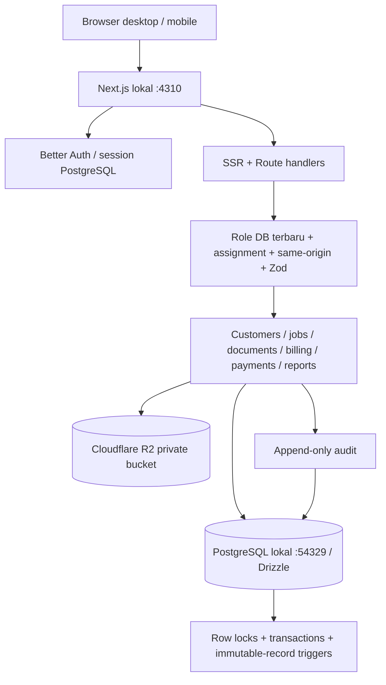
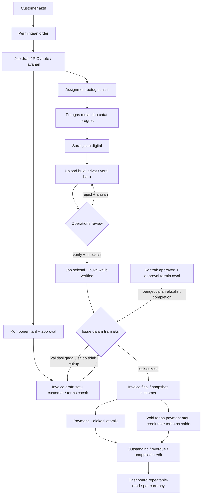
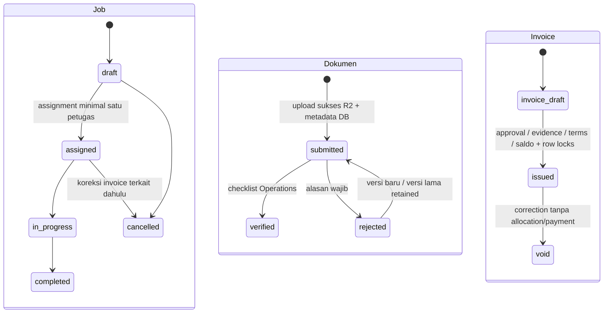
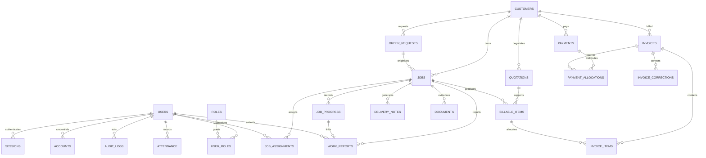

# Arsitektur dan aturan workflow SGI One

Paid, partially paid dan overdue merupakan proyeksi, bukan status manual. `outstanding = total issued - allocation - corrections`. `unapplied = payment - sum allocation`. Invoice draft/void tidak masuk penagihan issued. Credit notes tidak menghapus invoice atau payment.

Profile PRD digabung ke `users` Better Auth; `verification` dan `auth_rate_limits` melengkapi schema autentikasi. Uang memakai bigint minor units mode number dengan batas input, perhitungan subtotal/pajak memakai BigInt. Tanggal tersimpan timestamptz; tampilan Asia/Jakarta. Sequence PostgreSQL menjaga nomor unik; rollback boleh menghasilkan gap nomor.

`work_reports` menghubungkan catatan lapangan ke satu `job_progress`; foto opsional disimpan privat di R2. Constraint memastikan metadata foto lengkap atau seluruhnya null. Upload divalidasi lebih dulu, lalu job dikunci dan assignment/status diperiksa ulang sebelum progress, laporan dan audit di-commit. Jika transaksi gagal, object R2 dibersihkan. Pembukaan foto memeriksa assignment kembali dan tidak menggunakan cache publik. Foto laporan bukan dokumen checklist verified.

Dashboard memilih hanya role yang sudah dimiliki pengguna, lalu mempersempit actor ke role itu untuk query. Dashboard direktur memakai snapshot finansial; dashboard petugas hanya assignment dan aktivitas pribadi. Pencarian global memeriksa permission sebelum memanggil query scoped setiap jenis data; URL role tidak bisa menambah izin. Pencarian mengembalikan label, konteks singkat dan route, tanpa object key atau kredensial.

Penerbitan mengunci invoice lalu jobs/billables dalam urutan ID konsisten dan customer, menghitung ulang alokasi issued, memeriksa bukti versi terbaru, menyimpan snapshot dan audit dalam satu commit. Payment allocation mengunci payment (untuk alokasi susulan), lalu invoice dalam urutan ID. Concurrent requests tidak bergantung pada nilai saldo dari browser.
